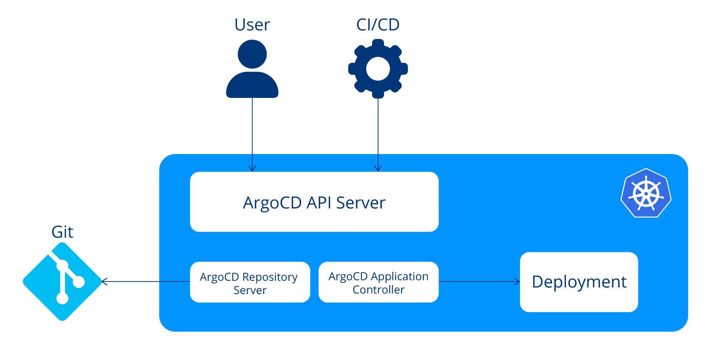
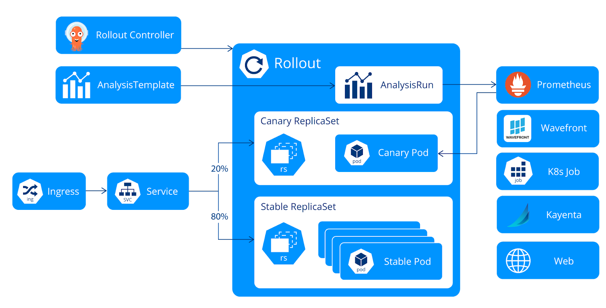

# Certified-Argo-Project-Associate-CAPA
Certified Argo Project Associate (CAPA)


---

## 🚀 Quick Start

To set up a local Kind cluster with Istio and ArgoCD, follow the step-by-step guide:

👉 **[Setup Guide → infra/README.md](infra/README.md)**

This includes:

- Kind cluster creation
- Istio & ArgoCD installation
- Accessing the ArgoCD UI
- Cleanup steps

---

## 📚 Resources

- [ArgoCD Documentation](https://argo-cd.readthedocs.io/)
- [Istio Documentation](https://istio.io/)
- [Kind Documentation](https://kind.sigs.k8s.io/)

---

# Introduction to Argo

## What Is GitOps?
- Backbone of modern Software delivery practice

### Five key aspects:
- Declarative configuration
- Immutable storage
- Automation
- Software agents
- Closed loop

## What Is Argo?
- Kubernetes-native tools with workflow management capabilities of Kubernetes.
- includes 
    - Argo Continuous Delivery (CD)
    - Argo Workflows for running complex jobs
    - Argo Events for event-based dependency management 
    - Argo Rollouts for progressive delivery

### Argo Continuous Delivery (CD)
- declarative, GitOps Continuous Delivery tool for Kubernetes

features:
- blue-green and canary update strategies
- integrates with service meshes
- ingress controllers to shape traffic
- automates promotion
- rollback based on analysis
- safely deploy artifacts into Production

### Argo Workflows
- A kind of ci tool same like jenkins

### Argo Events
- event-driven workflow automation framework
- helps you trigger Kubernetes objects, Argo Workflows, serverless workloads, and other processes in response to events from various sources such as webhooks, S3, schedules, messaging queues, GCP PubSub, and more. It supports events from over 20 event sources and allows you to customize business-level constraint logic for workflow automation.
- 2 components of argo workflow: Trigger and Event Sources.

### Argo rollouts
- progressive delivery controller
- born because k8s does not support deployment strategies by its own
- helps with
    - blue-green and canary update strategies
    - integrates with service meshes and ingress controllers to shape traffic
    - and automates promotion and rollback based on analysis

Quiz:

2.1 What is Argo’s role in Kubernetes workflow management?

a. Argo is a database management tool \
b. Argo provides version-controlled application deployment and workflow automation \
c. Argo is a containerization platform \
d. Argo is a networking solution for Kubernetes 

Ans: b

2.2 What is the primary role of Kubernetes in the context of Argo’s functionalities?

a. Kubernetes is a version control system \
b. Kubernetes provides essential infrastructure for container orchestration \
c. Kubernetes is a continuous delivery tool \
d. Kubernetes is a database management system 

Ans: b

2.3 How does Argo align with modern development practices, ensuring a single source of truth for both code and infrastructure?

a. Utilizing Docker Compose files \
b. Enforcing Microservices architecture \
c. Removing outdated practices from Kubernetes \
d. Following the principles of GitOps

Ans: D

## Argo CD
- declarative, GitOps continuous delivery tool

### Advancements
- GitOps
- Continuous Delivery
- Rollbacks
- Multi-environment management
- UI and API

### Vocabulary
- Configuration
    - Application
    - Application source type: helm/kustomize
- States
    - Target state
    - Live state
- Statuses
    - Sync status
    - Sync operation status
    - Health status 
- Actions
    - Sync
    - Refresh

### Core componmenmts
https://argo-cd.readthedocs.io/en/stable/operator-manual/architecture/


- controllers
- API Server
- Repository Server
- Application Controller




### Argo CD reconciliation loop


### Synchronization Principles
- Customization Solutions
    - Resource hooks --> uses kind: Job
        - PreSync
        - Sync
        - PostSync
        - Skip
        - SyncFail

    https://argo-cd.readthedocs.io/en/stable/user-guide/resource_hooks/
    - Sync waves
        each sync wave is 2 sec delayed, to modify it update this environment variable ARGOCD_SYNC_WAVE_DELAY
### Simplifying Application Management
- Application
  ```yaml
  apiVersion: argoproj.io/v1alpha1
  kind: Application
  metadata:
    name: guestbook
    namespace: argocd
  spec:
    project: default
    source:
      repoURL: 'htt‌ps://github.com/argoproj/argocd-example-apps.git'
      targetRevision: HEAD
      path: guestbook
  destination:
    server: 'htt‌ps://kubernetes.default.svc'
    namespace: guestbook
  ```

- AppProject

  ```yaml
  apiVersion: argoproj.io/v1alpha1
  kind: AppProject
  metadata:
    name: production
    namespace: argocd
  spec:
    description: Production applications
    sourceRepos:
      - '*'
    destinations:
      - namespace: production
        server: 'htt‌ps://kubernetes.default.svc'
    clusterResourceWhitelist:
      - group: '*'
        kind: '*'
  ```

- Repository credentials

  ```yaml
  apiVersion: v1
  kind: Secret
  metadata:
    name: private-repo-creds
    namespace: argocd
    labels:
      argocd.argoproj.io/secret-type: repository
  stringData:
    url: 'htt‌ps://github.com/private/repo.git'
    username: <username>
    password: <password>
  ```

- Cluster credentials

  ```yaml
  apiVersion: v1
  kind: Secret
  metadata:
    name: external-cluster-creds
    labels:
      argocd.argoproj.io/secret-type: cluster
  type: Opaque
  stringData:
    name: external-cluster
    server: 'ht‌tps://external-cluster-api.com'
    config: |
      {
        "bearerToken": "<token>",
        "tlsClientConfig": {
          "insecure": false,
          "caData": "<certificate encoded in base64>"
        }
      }
  ```

### Argo CD Extensions & Integrations
- Plugins --> we can manage it with configmap

  ```yaml
  apiVersion: v1
  kind: ConfigMap
  metadata:
    name: argocd-notifications-cm
  data:
    context: |
      region: east
      environmentName: staging

    template.a-slack-template-with-context: |
      message: "Something happened in {{ .context.environmentName }} in the {{ .context.region }} data center!"
  ```

### Securing Argo CD
- Use RBAC
- Manage Secrets Securely
- Regularly Update Argo CD


## Workflow

A Workflow spec has two core parts:

- Entrypoint: Specifies the name of the template that serves as the entrypoint for the workflow. It defines the starting point of the workflow execution.
- Templates: A template represents a step or task in the workflow that should be executed. There are six types of templates that we will introduce next.

### Template Types
- Template Definitions
  - ***Container***: A Container is the most common template type and represents a step in the workflow that runs a container. It is suitable for executing containerized applications or scripts. Example:

    ```yaml
    - name: whalesay
      container:
        image: docker/whalesay
        command: [cowsay]
        args: ["hello world"]
    ```

  - ***Resource***: A Resource represents a template for creating, modifying, or deleting Kubernetes resources. It is useful for performing operations on Kubernetes objects. Example:

    ```yaml
      - name: k8s-owner-reference
        resource:
          action: create
          manifest: |
            apiVersion: v1
            kind: ConfigMap
            metadata:
              generateName: owned-eg-
            data:
              some: value
    ```

  - ***Script***: A Script is similar to the container template but allows specifying the script inline without referencing an external container image. It can be used for simple scripts or one-liners. Example:

    ```yaml
    - name: gen-random-int
      script:
        image: python:alpine3.6
        command: [python]
        source: |
          import random
          i = random.randint(1, 100)
          print(i)
    ```

  - ***Suspend***: A Suspend is a template that suspends execution, either for a duration or until it is resumed manually. It can be resumed using the CLI, the API endpoint, or the UI. Example:

    ```yaml
    - name: delay
      suspend:
        duration: "20s"
    ```

- Template Invocators
  - ***DAG***: Defining task as a Dependency Graph, used for complex dependencies and conditional execution

    ```yaml
    - name: diamond
      dag:
        tasks:
        - name: A
          template: echo
        - name: B
          dependencies: [A]
          template: echo
        - name: C
          dependencies: [A]
          template: echo
        - name: D
          dependencies: [B, C]
          template: echo
    ```

  - ***Steps***: Steps are defining multiple steps within a template as several steps need to be executed sequentially or in parallel.

    ```yaml
    - name: hello-hello-hello
      steps:
      - - name: step1
          template: prepare-data
      - - name: step2a
          template: run-data-first-half
        - name: step2b
          template: run-data-second-half
    ```


  ### Outputs
  - Defining Outputs
  - Accessing Outputs

  ```yaml
  apiVersion: argoproj.io/v1alpha1
  kind: Workflow
  metadata:
    generateName: artifact-passing-
  spec:
    entrypoint: artifact-example
    templates:
    - name: artifact-example
      steps:
      - - name: generate-artifact
          template: whalesay
      - - name: consume-artifact
          template: print-message
          arguments:
            artifacts:
            - name: message
              from: "{{steps.generate-artifact.outputs.artifacts.hello-art}}"

    - name: whalesay
      container:
        image: docker/whalesay:latest
        command: [sh, -c]
        args: ["cowsay hello world | tee /tmp/hello_world.txt"]
      outputs:
        artifacts:
      - name: hello-art
        path: /tmp/hello_world.txt

    - name: print-message
      inputs:
        artifacts:
        - name: message
          path: /tmp/message
      container:
        image: alpine:latest
        command: [sh, -c]
        args: ["cat /tmp/message"]
  ```
### WorkflowTemplate
  ```yaml
  apiVersion: argoproj.io/v1alpha1
  kind: WorkflowTemplate
  metadata:
    name: sample-template
  spec:
    templates:
    - name: hello-world
      inputs:
        parameters:
          - name: msg
            value: "Hello World!"
      container:
        image: docker/whalesay
        command: [cowsay]
        args: ["{{inputs.parameters.msg}}"]
  ```

  ```yaml
  apiVersion: argoproj.io/v1alpha1
  kind: Workflow
  metadata:
    generateName: hello-world-
  spec:
  entrypoint: whalesay
  templates:
    - name: whalesay
      steps:
        - - name: hello-world
            templateRef:
              name: sample-template
              template: hello-world
  ```
### Argo Workflows Architecture
- Argo Server - same like kube api server - provides REST API interface for submission monitoring and management 
- Workflow Controller
- Argo UI

## Argo Rollouts
### Continuous Integration
- Frequent code commits
- Automated tests
- Immediate problem detection
- Reduced integration problems

### Continuous Delivery
- Automated release process
- Reliable deployments
- Rapid release cycles
- Close collaboration between teams

### Progressive Delivery
- **Canary releases**: Gradually roll out the change to a small subset of users before rolling it out to the entire user base.
- **Feature flags**: Control who gets to see what feature in the application, allowing for selective and targeted deployment.
- **Experiments & A/B testing**: Test different versions of a feature with different segments of the user base.
- **Phased rollouts**: Slowly roll out features to incrementally larger segments of the user base, monitoring and adjusting based on feedback.

### Deployment Strategies
- Recreate/fixed deployment
- Rolling update
- Blue-green deployment
- Canary deployment


### Building Blocks of Argo Rollouts


### Argo Rollouts Components
- Argo Rollouts Controller
- Argo Rollout Resource - customn resource - https://argo-rollouts.readthedocs.io/en/stable/features/specification/
- Ingress - Kubernetes Ingress resource - https://kubernetes.io/docs/concepts/services-networking/ingress/
- Service - Kubernetes Service resource  - https://kubernetes.io/docs/concepts/services-networking/service/
- ReplicaSet - Kubernetes ReplicaSet resource  - https://kubernetes.io/docs/concepts/workloads/controllers/replicaset/
- AnalysisTemplate and AnalysisRun
- Metric Providers

### Argo Rollouts Functionalities
- Blue-green deployments
- Canary deployments
- Advanced traffic routing
- Integration with metric providers
- Automated decision making
---

## Argo Events
### Event-Driven Architecture

- Event Source
- Sensor
- EventBus
- Trigger

## 🧾 License

This project is licensed under the MIT License. See [LICENSE](LICENSE) for details.

---

## 🙌 Contributing

Contributions are welcome! Please open issues or submit pull requests if you find bugs or have suggestions.

---